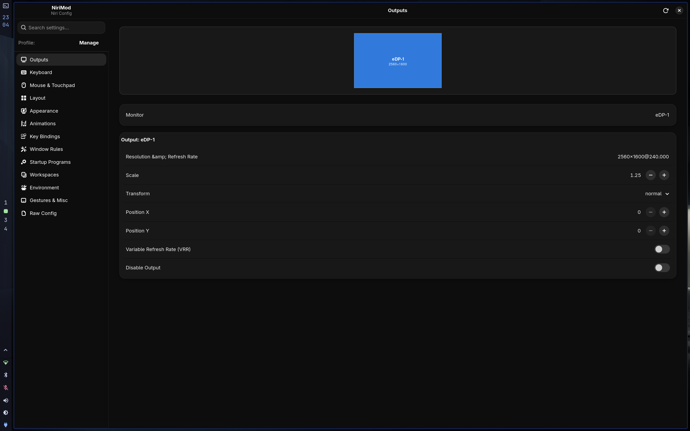
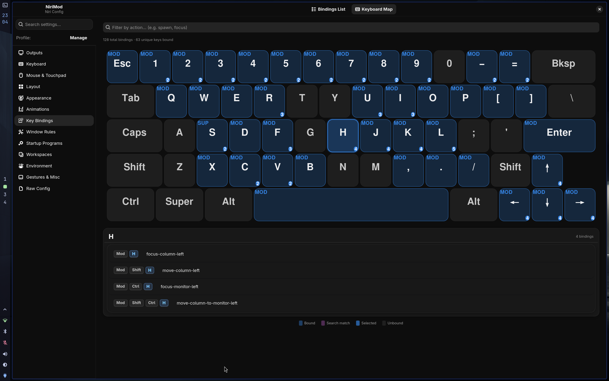

# NiriMod

<div align="center">

**A polished, native GTK4/libadwaita companion for the [niri](https://github.com/niri-wm/niri) Wayland compositor.**

NiriMod transforms the way you interact with your window manager — providing a visual, safe, and intuitive interface for deep configuration. No more hand-editing KDL files.

[](LICENSE)
[](https://python.org)
[](https://gtk.org)
[](https://wayland.freedesktop.org)

</div>

---

## 📸 Screenshots

### Monitor & Output Configuration

> Visually arrange your displays, set resolutions, refresh rates, scale factors, and transforms — all without touching a single line of KDL.



---

### Interactive Keyboard Visualizer

> Every key on your keyboard lights up with how many niri bindings are assigned to it. Click any key to instantly see which actions it triggers, with full modifier context. A live legend shows bound, unbound, selected, and search-matched keys at a glance.



---

## 🎬 Demo

> See NiriMod in action — from launch, through configuration, to saving a validated config back to disk.

https://github.com/user-attachments/assets/nirimod.mp4

> *(Download [`nirimod.mp4`](media/nirimod.mp4) if the inline player doesn't load.)*

---

## 🛠 Features that Elevate Your Workflow

NiriMod isn't just a wrapper for a text file; it's a dedicated environment for fine-tuning your desktop experience.

### 📐 Visual Geometry & Motion
- **Monitor Canvas:** Arrange your outputs with a drag-and-drop visual interface *(see screenshot above)*.
- **Bézier Curve Editor:** Fine-tune window animations with a live, interactive curve tool — no more trial-and-error with numeric values.
- **Direct Layout Control:** Configure workspaces, window gaps, and layout rules with instant visual feedback.

### ⌨️ The Interactive Bindings Suite
- **Keyboard Visualizer:** A stunning, interactive map of your keyboard that shows your current niri bindings in real-time, with per-key binding counts and modifier highlighting *(see screenshot above)*.
- **Collision Detection:** NiriMod alerts you if you're trying to set conflicting shortcuts.
- **Shortcut Discovery:** Easily browse and edit your existing keybindings without digging through KDL files.

### 🛡 Built-In Safety & Stability
- **Zero-Risk Saving:** Every change is automatically validated against the `niri validate` engine before it touches your disk. If it's not a valid config, NiriMod won't save it.
- **Unlimited Undo/Redo:** Experiment freely. Revert any change instantly with `Ctrl+Z`.
- **Profiles:** Create and switch between named configuration profiles (e.g., "Deep Work", "Gaming", or "Presentation") in seconds.

### 🛠 Power User Tools
- **Raw Mode:** A built-in code editor for those moments when you want to dive into the manual KDL configuration with syntax highlighting.
- **Startup Manager:** Visually manage the apps and scripts that launch with your compositor.

---

## 🚀 Installation

The simplest way to install NiriMod and all its dependencies is through the interactive installer.

```bash
# One-line interactive install
curl -sSL https://raw.githubusercontent.com/srinivasr/nirimod/main/install.sh | bash
```

### Advanced Installation Options

| Flag | Purpose |
| :--- | :--- |
| `--install` | Direct non-interactive installation from GitHub. |
| `--local` | Install from the current directory (perfect for developers). |
| `--uninstall` | Clean removal of NiriMod and its artifacts. |

---

## 🏗 Requirements

NiriMod is designed for modern Linux systems and supports all major distributions (Arch, Fedora, openSUSE, Debian/Ubuntu).

| Dependency | Notes |
| :--- | :--- |
| **Python 3.12+** | Core runtime |
| **GTK4 + libadwaita** | Native UI toolkit |
| **PyGObject** | Python GTK bindings |
| **[uv](https://github.com/astral-sh/uv)** | Virtual environment manager — automatically handled by the installer |
| **niri** | The Wayland compositor this tool configures |

---

## 💡 Inspiration

NiriMod was inspired by [**Hyprmod**](https://github.com/BlueManCZ/hyprmod), an excellent configuration manager for the Hyprland compositor.

---

*NiriMod is an independent open-source project and is not affiliated with the core niri development team.*
